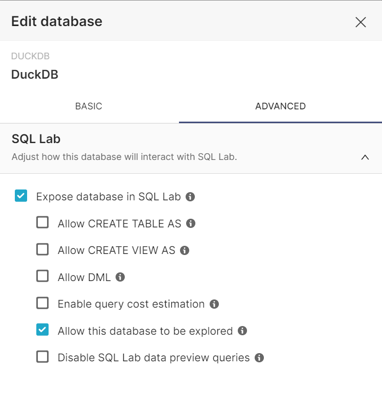

# Building a robust data analytics platform with the DuckDB, dbt, Iceberg and Superset
Modern analytics platforms require robust data storage, transformation, and management tools. DuckDB provides a simple, high-performance, columnar analytical database. DBT simplifies data transformation and modeling, and Iceberg offers scalable data lake management capabilities. Combining these tools can create a powerful and flexible analytics platform.

# Understanding the tools
## DuckDB
DuckDB is an in-memory, columnar analytical database that stands out for its speed, efficiency, and compatibility with SQL standard. Here is a more in-deepth look at its features:
- **High-performance Analytics**: DuckDB is optimized for analytical queries, making it an ideal choice for data warehousing and analytics workloads. It's in-memory storage and columnar data layout significantly boost query performance.
- **SQL Compatibility**: DuckDB supports SQL, making it accessible to analysts and data professionals who are ready familiar with SQL syntax. This compatibility allows you to leverage your existing SQL knowledge and tools.
- **Integration with BI Tools**: DuckDB integrates seamlessly with popular business intelligence (BI) tools like Tableau, Power BI, and Looker. This compatibility ensures that you can visualize and report on your data effectively.

## DBT
dbt, which stands for Data Build Tool, is a command-line tool that revolutionizes the way data transformations and modeling are done. Here's a deeper dive into dbt's capabilities:
- **Modular Data Transformations**: dbt uses SQL and YAML files to define data transformations and models. This modular approach allows you to break down complex transformations into smaller, more manageable pieces, enhancing mantainability and version control.
- **Data Testing**: dbt facilitates data testing by allowing you to define expectations about your data. It helps ensure data quality by automatically running tests against your transformed data.
- **Version Control**: dbt projects can be version controlled with tools like Git, enabling collaboration among data professionals while keeping a history of changes.
- **Incremental Builds**: dbt supports incremental builds, meaning it only processes data that has changed since the last run. This feature saves time and resources when working with large datasets.
- **Orchestration**: While dbt focuses on data transformations and modeling, it can be integrated with orchestration tools like Apache Airflow or dbt Cloud to create automated data pipelines.

## Iceberg
Iceberg is a table format designed for managing data lakes, offering several key features to ensure data quality and scalability:
- **Schema Evoluation**: One of Iceberg's standout features is its support for schema evolution. You can add, delete, or modify columns in your datasets without breaking existing queries or data integrity. This makes it suitable for rapidly evolving data lakes.
- **ACID Transformations**: Iceberg provides ACID (Atomicity, Consistency, Isolation, Durability) transactions, ensuring data consistency and reliability in multi-user and multi-write environments.
- **Time-Travel Capabilities**: Iceberg allows you to query historical versions of your data, making it possible to recover from data errors or analyze changes over time.
- **Optimized File Storage**: Iceberg optimizes file storage by using techniques like metadata management, partitioning, and file pruning. This results in efficient data storage and retrieval.
- **Connectivity**: Iceberg supports various storage connectors, including Apache Hadoop HDFS, Amazon S3, and Azure Data Lake Storage, making it versatile and compatible with different data lake platforms.

## Apache Superset
Apache Superset is a modern, open-source BI tool that enables data exploration, visualization, and interactive dashboards. It connects to various data sources and is designed to empower users to explore data and create dynamic reports.
- **Data Visualization**: Apache Superset allows users to create interactive visualizations, including charts, graphs, and geographic maps, to explore and understand data.
- **Dashboard Creation**: Users can build dynamic dashboards by combining multiple visualizations and applying filters for real-time data exploration.
- **Connectivity**: Apache Superset can connect to various data sources, including SQL databases, data lakes, and cloud storage, making it adaptable to diverse data ecosystems.
- **Security**: It offers robust security features, including role-based access control and integration with authentication providers, ensuring data is accessed securely.
- **Community and Extensibility**: As an open-source project, Apache Superset benefits from a vibrant community that contributes plugins, connectors, and additional features, enhancing its capabilities.
- **SQL Support**: Superset supports SQL queries, allowing users to execute custom queries and create complex calculated fields.

## Setting up DuckDB, dbt, Superset with Docker Compose
### Setting up DuckDB

### Setting up dbt
Firstly, We need to install *dbt-core* and *dbt-duckdb* libraries, then init a dbt project.
```yaml
# create a virtual environment
cd dbt
python -m venv .env
source .env/bin/activate

# install libraries
pip install -r requirements.txt

# check version
dbt --version
```
Then we initialize a dbt project with the name *stackoverflowsurvey* and create a *profiles.yml* with the following content:
```yaml
stackoverflow:
  target: dev
  outputs:
    dev:
      type: duckdb
      path: '/data/duckdb/stackoverflow.duckdb' # path to local DuckDB database file
```
Run the following commands to properly check configuration:
```bash
# We need to point out the directory of the profiles.yml file, because we are not using the default location.
dbt debug --profiles-dir .
```

### Setting up Superset
Once the **setup.sh** command has completed, visit *http://localhost:8088* to access the Superset UI. Enter **admin** as username and password. Choose **DuckDB** from the supported databases drop-down. Then set up a connection to DuckDB database.

<div align="center">
    <table >
        <tr>
            <td></td>
            <td></td>
        </tr>
    </table>
</div>

> **NOTE**: Provide path to a duckdb database on disk in the url, e.g., *duckdb:////Users/whoever/path/to/duck.db*.

We combie the DuckDB's database path file that exposed in *superset/docker/docker-compose.yml* file
```bash
x-superset-volumes:
  &superset-volumes
  - /data/duckdb:/app/duckdb
```
And the DuckDB database name that defined in *dbt/stackoverflowsurvey/profiles.yml*.
```yaml
path: '/data/duckdb/stackoverflow.duckdb'
```
So, we have the final uri to connection between Superset and DuckDB as below:
```bash
duckdb:///duckdb/stackoverflow.duckdb
```


